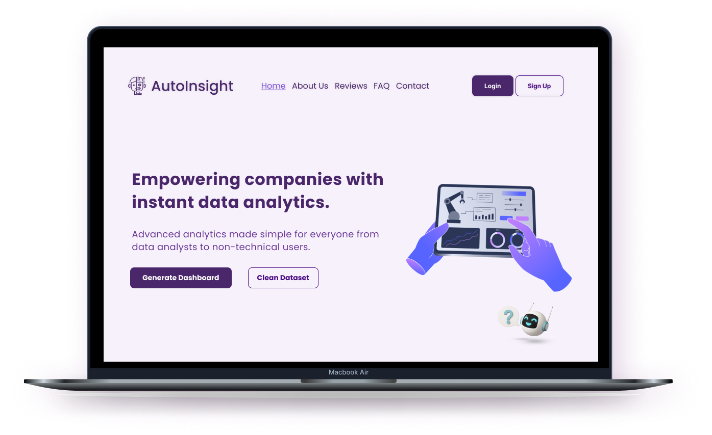
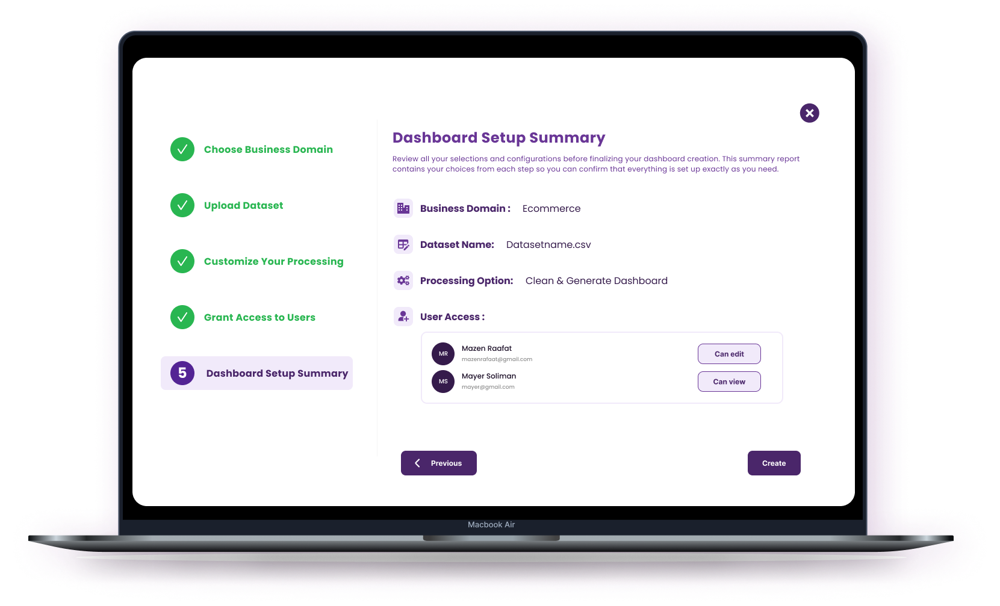
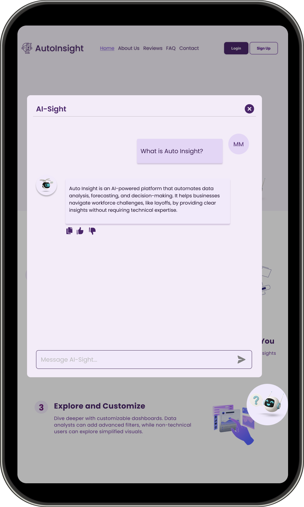
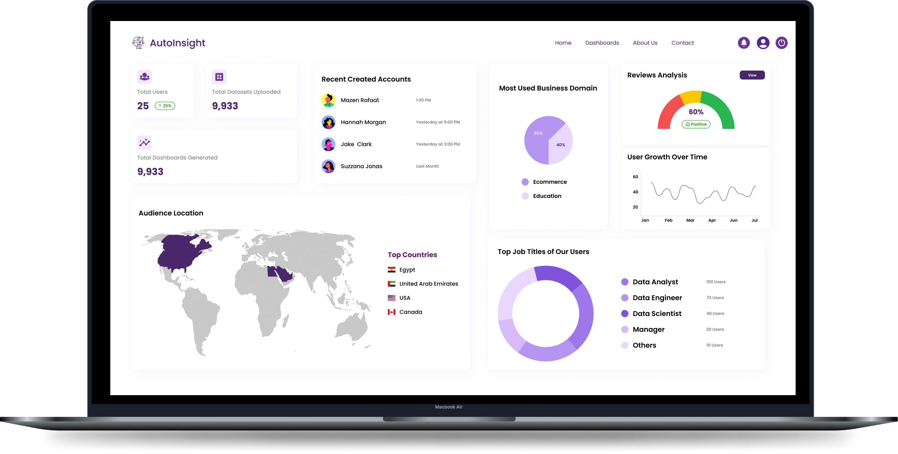

##  AutoInsight: Empowering Companies with Instant Data Analytics

<p align="center">
  
</p>

> **Transform raw CSVs into real business intelligence—no code, just clarity.**

---

##  Overview

**AutoInsight** is a **smart data analytics platform** built to simplify how businesses and analysts extract insights from raw CSV files. Powered by **AI**, **machine learning**, and a **dynamic visualization engine**, it makes data exploration fast, accessible, and impactful—even for non-technical users.

---

##  Key Features

###  CSV File Analysis

<p align="center">
  
</p>

*  Drag & drop CSV upload
*  Automatic detection of data types, missing values, outliers
*  Smart data cleaning suggestions

###  AI-Powered Chatbot

<p align="center">
  
</p>

*  Natural language interaction for data questions
*  "Explain Like I'm 5" mode for non-experts
*  Smart recommendations for business actions

###  Advanced Data Visualization

*  Line/Bar/Pie/Heat/Scatter plots
*  Interactive dashboards
*  Correlation matrix & clustering analysis
*  KDE Plots for variance distribution

### Predictive & Forecasting

*  Time-series forecasting (ARIMA, Prophet, etc.)
*  "What-If" simulations
*  Trend tracking over time

###  Admin Dashboard

<p align="center">
  
</p>

*  User heatmaps
*  Real-time signups & analytics by user type
*  Role-based usage metrics

---

##  Use Case Scenarios

<p align="center">
  
</p>


| **Role**               | **How They Use AutoInsight**                                   |
| ---------------------- | -------------------------------------------------------------- |
| **Data Analyst**       | Uploads raw exports, visualizes patterns, gets ML forecasts    |
| **Product Manager**    | Interacts with chatbot to discover user behavior trends        |
| **CEO/Founder**        | Gets a dashboard of KPIs and alerts on unusual activity        |
| **Marketer**           | Analyzes campaign CSV data and segments by performance         |
| **Non-Technical User** | Uses “Explain Like I’m 5” to understand customer or sales data |

---

##  System Architecture

<p align="center">
  
</p>

**Overview:**

* **Frontend**: React.js + TailwindCSS for responsive UI
* **Backend**: Python (FastAPI) handles AI, ML, file parsing, and chatbot integration
* **Database**: PostgreSQL for user & session metadata
* **File Storage**: Cloud/Local file system (AWS S3 / local disk)
* **AI**: Google Gemini API + Scikit-learn models
* **Visualization Engine**: Plotly, Seaborn, Matplotlib

---

##  Database Schema

<p align="center">
  
</p>


---

##  Flow Chart

<p align="center">
  
</p>
<p align="center">
  
</p>

**Flow Summary:**

1. User uploads CSV
2. Backend parses & stores metadata
3. AI Engine analyzes & returns insights
4. Chatbot answers questions based on stored context
5. User explores visualizations or downloads results

---

##  Installation & Setup

> **Local Installation (Dev Mode)**

```bash
# 1. Clone the repository
git clone https://github.com/your-repo/autoinsight.git
cd autoinsight

# 2. Install backend requirements
cd backend
pip install -r requirements.txt

# 3. Run FastAPI server
uvicorn main:app --reload

# 4. Start frontend
cd ../frontend
npm install
npm run dev
```

> **Note:** You need a valid Google Gemini API key in `.env`.

---

##  Tech Stack

| Category             | Technologies Used                 |
| -------------------- | --------------------------------- |
| **Frontend**         | React.js, TailwindCSS             |
| **Backend**          | FastAPI, Flask (optional), Python |
| **Database**         | PostgreSQL, SQLAlchemy            |
| **Visualization**    | Seaborn, Matplotlib, Plotly       |
| **Machine Learning** | Scikit-learn, Prophet, ARIMA      |
| **AI Chatbot**       | Google Gemini API                 |
| **Auth**             | JWT + OAuth (planned)             |

---


##  Want to Contribute?

We love community contributions! Here's how you can help:

1.  Fork the repo
2.  Create a new branch (`feat-new-x`)
3.  Make changes and test them
4.  Submit a pull request

Check the [`CONTRIBUTING.md`](CONTRIBUTING.md) for more details.

---

## 📬 Contact & Community

📧 Email: `farahmoataz90@gmail.com`
🔗 LinkedIn: [AutoInsight](https://www.linkedin.com/in/farah-moataz/)

---

<p align="center">
  
</p>

---

<p align="center" style="font-weight: bold; font-size: 20px;">
✨ From Raw Data to Real Decisions—With Just One Upload ✨  
</p>

